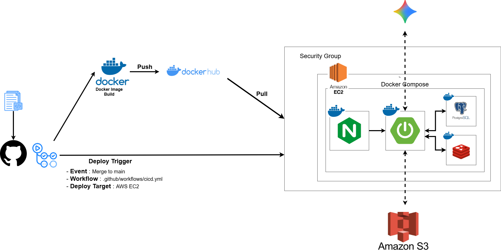

# 🍽️ 3-Servings

Spring Boot 기반 음식 주문 관리 플랫폼

     

## 📌 Project Overview

### 🎯 프로젝트 목적

전화 주문 중심의 음식점 운영 방식을 온라인 서비스로 구현하여 고객의 주문부터 점주의 주문 관리와 결제까지 하나의 플랫폼에서 처리할 수 있는 음식 주문 관리 시스템을 개발하는 것을 목표로 합니다.

### 📝 프로젝트 상세

- Spring Boot 기반의 모놀리식 아키텍처를 적용하여 음식 주문 관리 플랫폼을 구현했습니다.
- 고객(CUSTOMER)은 가게와 메뉴를 조회하고 장바구니를 통해 주문 및 결제를 진행할 수 있습니다.
- 점주(OWNER)는 가게와 메뉴를 관리하고 주문을 수락·거절하며 주문 상태를 변경하고 조리 과정을 관리할 수 있습니다.
- AI 기반 메뉴 설명 생성 기능과 Toss Payments 결제 연동을 통해 실제 서비스와 유사한 기능을 구현했습니다.
- Docker, AWS EC2, Nginx, GitHub Actions를 활용하여 컨테이너 기반 배포 및 CI/CD 환경을 구축했습니다.

### 📋 프로젝트 정보

- **프로젝트 기간** : 2026.07.02 ~ 2026.07.16
- **개발 인원** : 6명
- **아키텍처** : Spring Boot Monolithic
- **배포 환경** : AWS EC2 + Docker + Nginx

## ✨ 주요 기능

| 👤 회원(Auth) | 🏪 가게 | 🍽️ 메뉴 | 🛒 장바구니 |
|:---:|:---:|:---:|:---:|
| ✅ 회원가입 / 로그인<br>✅ 소셜 로그인<br>✅ JWT 인증<br>✅ Access Token 재발급<br>✅ 로그아웃 / 회원탈퇴 | ✅ 가게 CRUD<br>✅ 카테고리 관리<br>✅ 지역 관리<br>✅ 서비스 가능 지역 설정 | ✅ 메뉴 CRUD<br>✅ 메뉴 카테고리 관리<br>✅ 옵션 그룹 관리<br>✅ Presigned URL 발급<br>✅ AI 상품 설명 생성 | ✅ 장바구니 생성 및 조회<br>✅ 메뉴 담기<br>✅ 수량 변경<br>✅ 항목 삭제 |

| 📦 주문 | 👨‍🍳 주문 관리 | 💳 결제 | ⭐ 리뷰 |
|:---:|:---:|:---:|:---:|
| ✅ 체크아웃(주문 생성)<br>✅ 주문 조회<br>✅ 주문 수정 / 취소 | ✅ 주문 수락 / 거절<br>✅ 주문 상태 변경<br>✅ 예상 조리시간 수정<br>✅ 주문 통계 조회 | ✅ Toss Payments 연동<br>✅ 결제 요청 / 환불<br>✅ 결제 내역 조회<br>✅ 결제 로그 조회 | ✅ 리뷰 CRUD<br>✅ 가게 리뷰 조회<br>✅ 사장 답글 작성 / 수정 |

## 👨‍💻 Team Members

| 이름 | 담당 |
|:----:|------|
| 나상우 | 회원(Auth), 가게 |
| 남건우 | 회원(Auth), 리뷰 |
| 👑[팀장] 김동현 | 메뉴 |
| 김준서 | 주문 |
| 주원영 | 주문 관리 |
| 이은빈 | 결제, 인프라 |

## 🛠 Tech Stack

### Backend

    

### Database

 

### Infra

     

### Collaboration

  


## 🏗️ Service Architecture



Docker Compose를 기반으로 애플리케이션을 컨테이너화하고 AWS EC2 환경에 배포했습니다. <br><br>

✔️ Docker Compose를 통해 Spring Boot, PostgreSQL, Redis를 컨테이너로 구성<br>
✔️ Nginx Reverse Proxy를 적용하여 외부 요청을 처리<br>
✔️ GitHub Actions 기반 CI/CD를 구축하여 자동 배포
## 🗄 ERD

🔗 [ERD Cloud](https://www.erdcloud.com/d/m7CQPnZPCsg9htrRu)

## 📄 API Documentation

🔗 [API 명세서](https://app.notion.com/p/API-Documentation-39eae307a7908060bc1feae79ac5b082?source=copy_link)

## 🚀 Quick Start

### 1. Clone Repository

```bash
git clone https://github.com/3-servings/3-servings.git
cd 3-servings
```

### 2. Environment Variables

프로젝트 실행 전 `.env` 파일을 생성하고 아래 환경 변수를 설정합니다.

```env
# Spring Profile
SPRING_PROFILES_ACTIVE=

# PostgreSQL
DB_URL=
DB_USERNAME=
DB_PASSWORD=

# Redis
REDIS_HOST=
REDIS_PORT=

# S3
AWS_REGION=
S3_BUCKET_NAME=
AWS_ACCESS_KEY_ID= 
AWS_SECRET_ACCESS_KEY= 
CLOUD_FRONT_DOMAIN=

# JWT
JWT_SECRET=

# TOSS
TOSS_SECRET_KEY=

# Kakao
KAKAO_CLIENT_ID=
KAKAO_REST_API_KEY=
KAKAO_REDIRECT_URI=

# Gemini
GEMINI_API_KEY=
```

### 3. Run

```bash
docker compose up -d
```

### 4. Access

애플리케이션 실행 후 아래 주소로 접속할 수 있습니다.

```
http://localhost:19096
```

### 5. Stop

실행 중인 컨테이너를 종료합니다.

```bash
docker compose down
```

데이터 볼륨까지 함께 삭제하려면 다음 명령어를 사용합니다.

```bash
docker compose down -v
```